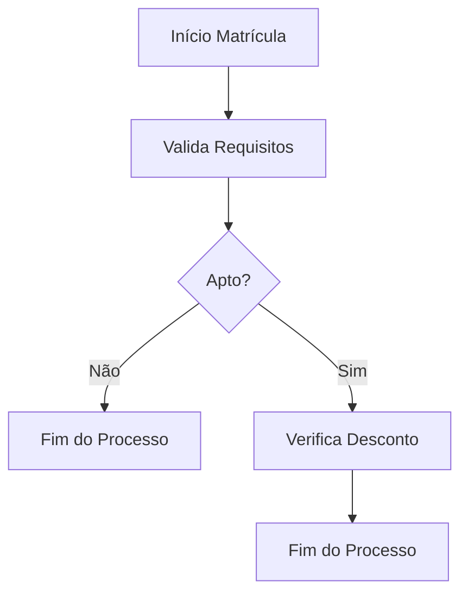

# Business Requirements Document (BRD)
(*Documento gerado por IA*)

**Projeto:** Regras de Aptidão para Matrícula e Descontos de Mensalidade  
**Cliente:** Escola [Nome da Escola]  
**Data:** 21/04/2025
**Versão:** 1.0  
**Solicitante:** Secretaria Escolar / Administração  
**Responsável Técnico:** TI  
**Ferramenta de Regras:** Drools

---

## 1. Visão Geral

Este documento descreve os requisitos de negócio para a automação das regras de aptidão para matrícula de alunos e concessão de descontos na mensalidade, visando padronizar e agilizar o processo de matrícula e garantir a correta aplicação das políticas da escola.

---

## 2. Objetivos do Projeto

- Garantir que apenas alunos aptos, conforme critérios institucionais e legais, possam efetuar matrícula.
- Automatizar a concessão de descontos na mensalidade, de acordo com critérios claros e não cumulativos.
- Permitir flexibilidade para ajustes futuros nas regras, sem necessidade de reescrita de código.
- Prover rastreabilidade e transparência nas decisões do sistema.

---

## 3. Escopo

**Incluído:**

- Implementação das regras de aptidão para matrícula.
- Implementação das regras de desconto na mensalidade.
- Registro dos motivos de (in)aptidão e desconto aplicado.
- Parametrização das regras para ajustes futuros.

**Excluído:**

- Processos de análise socioeconômica detalhada.
- Integração com sistemas externos de convênios (neste momento).
- Emissão de boletos e cobrança financeira.

---

## 4. Requisitos de Negócio

| ID     | Descrição do Requisito                                                                 | Tipo        |
|--------|----------------------------------------------------------------------------------------|-------------|
| BR-01  | Validar se o aluno possui idade igual ou superior à idade mínima exigida para a turma. | Obrigatório |
| BR-02  | Verificar se há vagas disponíveis na turma pretendida.                                 | Obrigatório |
| BR-03  | Exigir apresentação dos documentos obrigatórios para matrícula.                        | Obrigatório |
| BR-04  | Para alunos transferidos, exigir histórico escolar e quitação de débitos.              | Obrigatório |
| BR-05  | Registrar aprovação em avaliação diagnóstica ou entrevista, quando aplicável.          | Opcional    |
| BR-06  | Para alunos estrangeiros, exigir documentação regularizada e tradução juramentada.      | Obrigatório |
| BR-07  | Para alunos com deficiência, exigir apresentação de laudo médico.                      | Obrigatório |
| BR-08  | Informar status da matrícula como "Apto" ou "Inapto", detalhando motivos.              | Obrigatório |
| BR-09  | Aplicar desconto de 10% se frequência superior a 80%.                                  | Obrigatório |
| BR-10  | Aplicar desconto de 10% se não houver advertências.                                    | Obrigatório |
| BR-11  | Aplicar desconto de 5% se não houver atraso superior a uma mensalidade.                | Obrigatório |
| BR-12  | Descontos não são cumulativos. Aplicar apenas o de maior prioridade.                   | Obrigatório |
| BR-13  | Registrar percentual, motivo do desconto e valor final da mensalidade.                 | Obrigatório |
| BR-14  | Permitir parametrização para inclusão futura de outros tipos de desconto.              | Opcional    |

---

## 5. Requisitos Não Funcionais

- Permitir ajustes nas regras via parametrização, sem necessidade de alteração de código-fonte.
- Registrar logs das decisões do motor de regras para fins de auditoria.
- Permitir simulação de matrícula e desconto para testes e treinamento.

---

## 6. Critérios de Aceitação

- Impedir matrícula de alunos que não atendam a todos os requisitos obrigatórios.
- Aplicar corretamente o desconto de maior prioridade, sem cumulatividade.
- Apresentar ao usuário os motivos de inaptidão e/ou desconto aplicado.
- Permitir atualização dos parâmetros das regras sem intervenção técnica complexa.

---

## 7. Fluxos de Processo

### Matrícula

1. Aluno preenche dados e envia documentos.
2. Sistema valida requisitos obrigatórios e complementares.
3. Sistema informa status: **Apto** ou **Inapto** (com motivos).

### Desconto

1. Sistema avalia critérios de desconto em ordem de prioridade.
2. Aplica desconto de maior prioridade.
3. Informa percentual, motivo e valor final.

#### Exemplo de Fluxograma

---

## 8. Glossário

- **Advertência:** Registro disciplinar formal.
- **Frequência:** Percentual de presença em relação ao total de aulas.
- **Inadimplência:** Atraso no pagamento de mensalidades.
- **Parametrização:** Capacidade de ajustar regras e critérios sem alterar o código-fonte.
---
